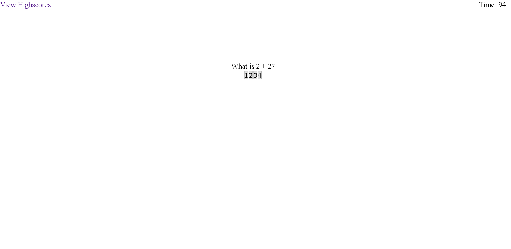

# Quiz App

---

[Link to App](https://b00000001.github.io/quizApp/index.html)

## This is a demo of a quiz app

- At the begining you are presented with a start button.
- The start button takes you to the main part of the quiz where a timer starts and you are presented with a series of multiple choice quiz questions.
- The You will be subtracted 5 points from your timer if you do not answer correctly.
- At the conclusion of the quiz, you will be given an opportunity to enter your initials for score tracking
- After entering initials you are given the choice to play again if you hit the corresponding button.
